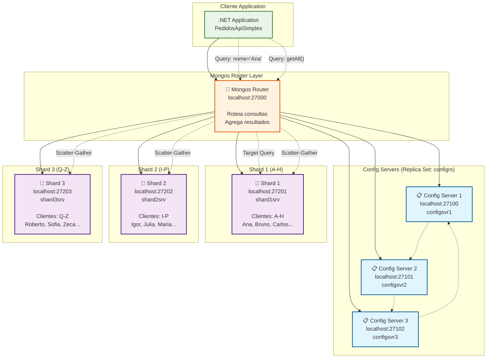
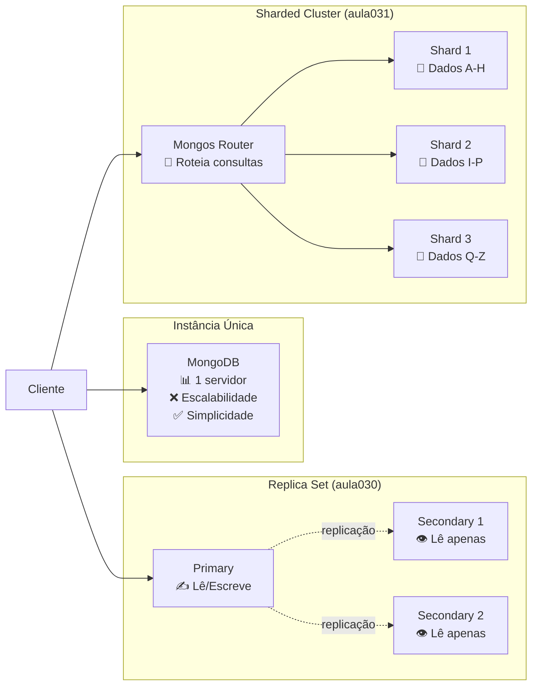
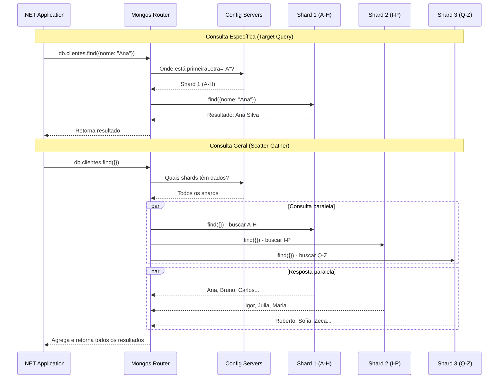
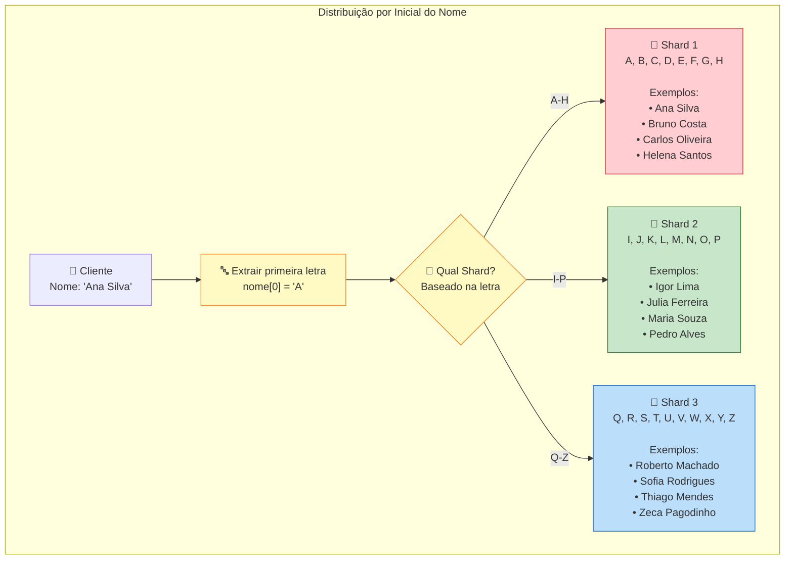

# Aula 031 - MongoDB Avançado: Sharding e Escalabilidade Horizontal

> **Objetivo**: Compreender conceitos de sharding no MongoDB através de um cluster com múltiplos shards, permitindo distribuição de dados baseada na inicial do nome do cliente.

## 📋 Objetivo

Demonstrar conceitos de sharding no MongoDB através de:

- **Sharding**: Distribuição horizontal de dados entre múltiplos servidores
- **Shard Key**: Estratégia de particionamento baseada na inicial do nome
- **Config Servers**: Servidores de metadados do cluster
- **Mongos Router**: Roteamento de consultas entre shards
- **Distribuição Automática**: Balanceamento de dados entre shards
- **Escalabilidade Horizontal**: Crescimento do sistema através de novos shards

## 🏗️ Arquitetura

### Diagrama da Arquitetura Sharded



### MongoDB Sharded Cluster

#### Config Servers (Metadados)

- **Config Server 1**: localhost:27100 (configsvr1)
- **Config Server 2**: localhost:27101 (configsvr2)
- **Config Server 3**: localhost:27102 (configsvr3)

#### Shard Servers (Dados)

- **Shard 1**: localhost:27201 (shard1srv) - Clientes A-H
- **Shard 2**: localhost:27202 (shard2srv) - Clientes I-P  
- **Shard 3**: localhost:27203 (shard3srv) - Clientes Q-Z

#### Mongos Router

- **Router**: localhost:27000 (mongos)

### Sharding vs Replica Set vs Instância Única



### Como Funciona o Roteamento de Consultas



```bash
# Instância única: Limitada a um servidor
MongoDB (single) → ❌ Escalabilidade horizontal
                   ❌ Distribuição de carga
                   ✅ Simplicidade

# Replica Set: Alta disponibilidade
Primary + Secondaries → ✅ Alta disponibilidade
                       ✅ Tolerância a falhas  
                       ❌ Escalabilidade horizontal

# Sharded Cluster: Escalabilidade + Distribuição
Mongos Router    → ✅ Escalabilidade horizontal
Shard1 + Shard2  → ✅ Distribuição de dados
+ Shard3         → ✅ Balanceamento automático
Config Servers   → ✅ Metadados distribuídos
```

### Estratégia de Sharding: Por Inicial do Nome



```csharp
// DISTRIBUIÇÃO POR INICIAL DO NOME
Shard 1 (A-H): "Ana", "Bruno", "Carlos", "Helena"
Shard 2 (I-P): "Igor", "Julia", "Maria", "Pedro"  
Shard 3 (Q-Z): "Roberto", "Sofia", "Thiago", "Zeca"

// SHARD KEY: Primeira letra do nome
{ "nome": "hashed" } // MongoDB calcula hash da primeira letra
// OU
{ "primeiraLetra": 1 } // Campo calculado explícito
```

## 🚀 Execução

### 1. Inicializar o Cluster

```bash
# Subir todos os containers
make up

# Aguardar inicialização (30-60 segundos)
make logs

# Configurar sharding
make setup-sharding
```

### 2. Testar Distribuição

```bash
# Executar exemplo .NET
cd PedidosApiSimples
dotnet run
```

### 3. Verificar Distribuição

```bash
# Conectar ao mongos
make mongo-shell

# Verificar status do cluster
sh.status()

# Verificar distribuição de dados
use pedidos
db.clientes.getShardDistribution()
```

## 📊 Comandos Úteis

### Configuração do Sharding

```javascript
// Habilitar sharding no banco
sh.enableSharding("pedidos")

// Criar índice na shard key
db.clientes.createIndex({ "primeiraLetra": 1 })

// Configurar sharding na coleção
sh.shardCollection("pedidos.clientes", { "primeiraLetra": 1 })

// Verificar status
sh.status()
```

### Monitoramento

```javascript
// Ver distribuição de chunks
db.printShardingStatus()

// Estatísticas por shard
db.clientes.getShardDistribution()

// Verificar balanceamento
sh.getBalancerState()
```

## 🔍 Comparação: Sem vs Com Sharding

### Sem Sharding (Instância Única)

```csharp
// TODOS os clientes no mesmo servidor
await collection.InsertOneAsync(cliente); // Sempre no mesmo lugar
var clientes = await collection.Find(x => true).ToListAsync(); // Uma consulta
```

### Com Sharding (Cluster Distribuído)

```csharp
// Clientes distribuídos automaticamente
await collection.InsertOneAsync(cliente); // Mongos roteia para shard correto
var clientes = await collection.Find(x => true).ToListAsync(); // Consulta todos os shards
```

## 🎯 Conceitos Fundamentais

### Shard Key

- **Definição**: Campo que determina como os dados são distribuídos
- **Estratégias**: Range, Hash, Zone-based
- **Escolha**: Deve distribuir uniformemente e permitir consultas eficientes

### Chunks

- **Definição**: Blocos lógicos de dados dentro de um range da shard key
- **Tamanho**: Padrão 64MB, configurável
- **Migração**: Movidos automaticamente entre shards para balanceamento

### Balanceamento

- **Automático**: MongoDB move chunks quando necessário
- **Manual**: Comandos específicos para forçar migração
- **Configurável**: Pode ser habilitado/desabilitado

## 🔧 Arquivos de Configuração

- `docker-compose.yml`: Definição completa do cluster sharded
- `configure-sharding.sh`: Script de configuração automática
- `Makefile`: Comandos para gerenciar o cluster
- `PedidosApiSimples/`: Aplicação .NET demonstrando uso

## 📚 Recursos Adicionais

- [MongoDB Sharding](https://docs.mongodb.com/manual/sharding/)
- [Shard Key Selection](https://docs.mongodb.com/manual/core/sharding-shard-key/)
- [Balancer](https://docs.mongodb.com/manual/core/sharding-balancer-administration/)

## 🎓 Próximos Passos

1. **Aula 040**: Redis para cache e sessões
2. **Aula 050**: DynamoDB - NoSQL da AWS
3. **Comparação**: Quando usar cada tipo de banco NoSQL

---

**Nota**: Este setup é para aprendizado. Em produção, use replica sets em cada shard para alta disponibilidade.
