# 8. Redlock - Distributed Locking com Redis

## O que é Redlock?

Redlock é um algoritmo distribuído para implementar locks (travas) usando múltiplas instâncias Redis independentes. Foi desenvolvido por Salvatore Sanfilippo (criador do Redis) para resolver o problema de coordenação entre múltiplos processos em ambientes distribuídos.

```mermaid
graph TB
    subgraph "Aplicação Distribuída"
        A1[Instância 1]
        A2[Instância 2]
        A3[Instância 3]
    end
    
    subgraph "Redis Cluster"
        R1[Redis 1]
        R2[Redis 2]
        R3[Redis 3]
        R4[Redis 4]
        R5[Redis 5]
    end
    
    A1 --> R1
    A1 --> R2
    A1 --> R3
    A1 --> R4
    A1 --> R5
    
    A2 -.-> R1
    A2 -.-> R2
    A2 -.-> R3
    A2 -.-> R4
    A2 -.-> R5
    
    A3 -.-> R1
    A3 -.-> R2
    A3 -.-> R3
    A3 -.-> R4
    A3 -.-> R5
    
    style A1 fill:#96ceb4
    style A2 fill:#ff6b6b
    style A3 fill:#ff6b6b
```



## Problema que Resolve

Em sistemas distribuídos, frequentemente precisamos garantir que apenas **uma instância** execute determinada operação crítica por vez:

### ❌ **Problemas Sem Locks Distribuídos**

```csharp
// Problema: Múltiplas instâncias processando o mesmo pedido
public class PaymentProcessor
{
    public async Task ProcessarPagamentoAsync(int pedidoId)
    {
        // 🚨 PROBLEMA: Múltiplas instâncias podem executar simultaneamente
        var pedido = await _repository.ObterPedidoAsync(pedidoId);
        
        if (pedido.Status == "Pendente")
        {
            await _paymentGateway.ProcessarAsync(pedido);
            await _repository.AtualizarStatusAsync(pedidoId, "Pago");
            
            // Resultado: Dupla cobrança! 💸
        }
    }
}
```

### ✅ **Solução com Redlock**

```csharp
public class PaymentProcessor
{
    private readonly IRedlockFactory _redlockFactory;
    
    public async Task ProcessarPagamentoAsync(int pedidoId)
    {
        var resource = $"payment:pedido:{pedidoId}";
        var expiry = TimeSpan.FromMinutes(2);
        
        using var redlock = await _redlockFactory.CreateLockAsync(resource, expiry);
        
        if (redlock.IsAcquired)
        {
            // ✅ Apenas UMA instância executa este código
            var pedido = await _repository.ObterPedidoAsync(pedidoId);
            
            if (pedido.Status == "Pendente")
            {
                await _paymentGateway.ProcessarAsync(pedido);
                await _repository.AtualizarStatusAsync(pedidoId, "Pago");
            }
        }
        else
        {
            _logger.LogWarning("Não foi possível adquirir lock para pedido {PedidoId}", pedidoId);
        }
    }
}
```

## Como Funciona o Algoritmo Redlock

### 1. **Algoritmo Step-by-Step**

```mermaid
sequenceDiagram
    participant Client
    participant Redis1
    participant Redis2
    participant Redis3
    participant Redis4
    participant Redis5
    
    Note over Client: 1. Gerar valor único
    Client->>Client: value = UUID()
    
    Note over Client: 2. Obter timestamp
    Client->>Client: start_time = now()
    
    Note over Client: 3. Tentar adquirir lock em TODAS as instâncias
    Client->>Redis1: SET resource value NX PX 30000
    Client->>Redis2: SET resource value NX PX 30000
    Client->>Redis3: SET resource value NX PX 30000
    Client->>Redis4: SET resource value NX PX 30000
    Client->>Redis5: SET resource value NX PX 30000
    
    Redis1-->>Client: OK
    Redis2-->>Client: OK
    Redis3-->>Client: OK
    Redis4-->>Client: (nil) - falhou
    Redis5-->>Client: OK
    
    Note over Client: 4. Verificar condições
    Client->>Client: locks_acquired = 4/5 >= 3 ✅
    Client->>Client: elapsed_time < validity ✅
    
    Note over Client: 5. Lock adquirido com sucesso!
```



### 2. **Condições para Sucesso**

Para o lock ser considerado **válido**, deve satisfazer:

1. **Maioria**: Adquirir lock em **N/2 + 1** instâncias Redis
2. **Tempo**: Tempo total < TTL do lock
3. **Unicidade**: Usar valor único para identificar o lock

### 3. **Implementação das Condições**

```csharp
public class RedlockAlgorithm
{
    private readonly IDatabase[] _databases;
    private readonly int _quorum;
    
    public RedlockAlgorithm(IDatabase[] databases)
    {
        _databases = databases;
        _quorum = (_databases.Length / 2) + 1; // Maioria
    }
    
    public async Task<RedlockResult> TryAcquireLockAsync(string resource, TimeSpan ttl)
    {
        var lockValue = Guid.NewGuid().ToString();
        var startTime = DateTime.UtcNow;
        var acquiredCount = 0;
        var acquiredDatabases = new List<int>();
        
        // 1. Tentar adquirir em todas as instâncias
        for (int i = 0; i < _databases.Length; i++)
        {
            try
            {
                var acquired = await _databases[i].StringSetAsync(
                    resource, 
                    lockValue, 
                    ttl, 
                    When.NotExists);
                
                if (acquired)
                {
                    acquiredCount++;
                    acquiredDatabases.Add(i);
                }
            }
            catch (Exception ex)
            {
                // Instância indisponível - continua tentando outras
                _logger.LogWarning("Redis instance {Instance} unavailable: {Error}", i, ex.Message);
            }
        }
        
        var elapsedTime = DateTime.UtcNow - startTime;
        var validityTime = ttl - elapsedTime - TimeSpan.FromMilliseconds(100); // Clock drift
        
        // 2. Verificar condições de sucesso
        if (acquiredCount >= _quorum && validityTime > TimeSpan.Zero)
        {
            return new RedlockResult
            {
                IsAcquired = true,
                LockValue = lockValue,
                ValidityTime = validityTime,
                AcquiredDatabases = acquiredDatabases,
                Resource = resource
            };
        }
        else
        {
            // 3. Falhou - liberar locks adquiridos
            await ReleaseLockAsync(resource, lockValue, acquiredDatabases);
            
            return new RedlockResult { IsAcquired = false };
        }
    }
}
```

## Implementação Prática em .NET

### 1. **Configuração do Redlock**

```csharp
// Program.cs
public void ConfigureServices(IServiceCollection services)
{
    // Configurar múltiplas instâncias Redis
    var redisEndpoints = new[]
    {
        "redis1.example.com:6379",
        "redis2.example.com:6379", 
        "redis3.example.com:6379",
        "redis4.example.com:6379",
        "redis5.example.com:6379"
    };
    
    var multiplexers = redisEndpoints.Select(endpoint =>
        ConnectionMultiplexer.Connect(endpoint)).ToList();
    
    services.AddSingleton<IRedlockFactory>(provider =>
        RedlockFactory.Create(multiplexers));
    
    services.AddScoped<CriticalOperationService>();
}
```

### 2. **Service com Redlock**

```csharp
public class CriticalOperationService
{
    private readonly IRedlockFactory _redlockFactory;
    private readonly ILogger<CriticalOperationService> _logger;
    
    public async Task<bool> ExecutarOperacaoCriticaAsync(string recurso, Func<Task> operacao)
    {
        var lockKey = $"critical:{recurso}";
        var expiry = TimeSpan.FromMinutes(5);
        
        using var redlock = await _redlockFactory.CreateLockAsync(lockKey, expiry);
        
        if (redlock.IsAcquired)
        {
            _logger.LogInformation("Lock adquirido para {Recurso}", recurso);
            
            try
            {
                await operacao();
                _logger.LogInformation("Operação concluída para {Recurso}", recurso);
                return true;
            }
            catch (Exception ex)
            {
                _logger.LogError(ex, "Erro durante operação crítica para {Recurso}", recurso);
                throw;
            }
        }
        else
        {
            _logger.LogWarning("Não foi possível adquirir lock para {Recurso}", recurso);
            return false;
        }
    }
}
```

### 3. **Casos de Uso Práticos**

#### A) **Processamento Único de Arquivos**

```csharp
public class FileProcessorService
{
    public async Task ProcessarArquivoAsync(string nomeArquivo)
    {
        var sucesso = await _criticalService.ExecutarOperacaoCriticaAsync(
            recurso: nomeArquivo,
            operacao: async () =>
            {
                var arquivo = await _storage.BaixarArquivoAsync(nomeArquivo);
                var dados = await _processor.ProcessarAsync(arquivo);
                await _repository.SalvarResultadoAsync(nomeArquivo, dados);
                await _storage.MarcarComoProcessadoAsync(nomeArquivo);
            });
        
        if (!sucesso)
        {
            _logger.LogInformation("Arquivo {Nome} já está sendo processado por outra instância", nomeArquivo);
        }
    }
}
```

#### B) **Geração de IDs Únicos**

```csharp
public class UniqueIdGeneratorService
{
    public async Task<string> GerarProximoIdAsync(string categoria)
    {
        var lockKey = $"id-generator:{categoria}";
        var expiry = TimeSpan.FromSeconds(30);
        
        using var redlock = await _redlockFactory.CreateLockAsync(lockKey, expiry);
        
        if (redlock.IsAcquired)
        {
            var ultimoId = await _repository.ObterUltimoIdAsync(categoria);
            var novoId = $"{categoria}-{ultimoId + 1:D6}";
            await _repository.SalvarUltimoIdAsync(categoria, ultimoId + 1);
            
            return novoId;
        }
        
        throw new InvalidOperationException("Não foi possível gerar ID único no momento");
    }
}
```

#### C) **Sincronização de Dados**

```csharp
public class DataSyncService
{
    public async Task SincronizarDadosExternosAsync()
    {
        var lockKey = "data-sync:external-api";
        var expiry = TimeSpan.FromMinutes(30);
        
        using var redlock = await _redlockFactory.CreateLockAsync(lockKey, expiry);
        
        if (redlock.IsAcquired)
        {
            _logger.LogInformation("Iniciando sincronização de dados externos");
            
            var ultimaSync = await _repository.ObterUltimaSincronizacaoAsync();
            var dadosNovos = await _externalApi.ObterDadosAPartirDeAsync(ultimaSync);
            
            foreach (var dado in dadosNovos)
            {
                await _repository.AtualizarDadoAsync(dado);
            }
            
            await _repository.MarcarUltimaSincronizacaoAsync(DateTime.UtcNow);
            
            _logger.LogInformation("Sincronização concluída: {Count} registros atualizados", dadosNovos.Count);
        }
        else
        {
            _logger.LogInformation("Sincronização já em andamento em outra instância");
        }
    }
}
```

## Configurações Avançadas

### 1. **Retry Logic**

```csharp
public class RedlockWithRetry
{
    private readonly IRedlockFactory _redlockFactory;
    
    public async Task<T> ExecuteWithLockAsync<T>(
        string resource, 
        Func<Task<T>> operation,
        TimeSpan lockExpiry,
        int maxRetries = 3,
        TimeSpan retryDelay = default)
    {
        retryDelay = retryDelay == default ? TimeSpan.FromMilliseconds(100) : retryDelay;
        
        for (int attempt = 1; attempt <= maxRetries; attempt++)
        {
            using var redlock = await _redlockFactory.CreateLockAsync(resource, lockExpiry);
            
            if (redlock.IsAcquired)
            {
                return await operation();
            }
            
            if (attempt < maxRetries)
            {
                _logger.LogWarning("Tentativa {Attempt} falhou para lock {Resource}, tentando novamente em {Delay}ms", 
                    attempt, resource, retryDelay.TotalMilliseconds);
                
                await Task.Delay(retryDelay);
                retryDelay = TimeSpan.FromMilliseconds(retryDelay.TotalMilliseconds * 1.5); // Exponential backoff
            }
        }
        
        throw new InvalidOperationException($"Não foi possível adquirir lock para {resource} após {maxRetries} tentativas");
    }
}
```

### 2. **Health Checks para Redlock**

```csharp
public class RedlockHealthCheck : IHealthCheck
{
    private readonly IRedlockFactory _redlockFactory;
    
    public async Task<HealthCheckResult> CheckHealthAsync(HealthCheckContext context, CancellationToken cancellationToken)
    {
        try
        {
            var testResource = $"health-check:{Environment.MachineName}:{Guid.NewGuid()}";
            var expiry = TimeSpan.FromSeconds(10);
            
            using var redlock = await _redlockFactory.CreateLockAsync(testResource, expiry);
            
            if (redlock.IsAcquired)
            {
                return HealthCheckResult.Healthy("Redlock funcionando corretamente");
            }
            else
            {
                return HealthCheckResult.Degraded("Redlock não conseguiu adquirir lock de teste");
            }
        }
        catch (Exception ex)
        {
            return HealthCheckResult.Unhealthy("Erro no Redlock", ex);
        }
    }
}
```

## Limitações e Considerações

### ⚠️ **Limitações do Redlock**

1. **Clock Drift**: Relógios desincronizados podem causar problemas
2. **Network Partitions**: Partições de rede podem levar a múltiplos locks
3. **Performance**: Overhead de comunicar com múltiplas instâncias Redis
4. **Complexidade**: Mais complexo que locks simples

### 🔧 **Boas Práticas**

```csharp
public class RedlockBestPractices
{
    // ✅ Timeouts apropriados
    public async Task ExemploTimeoutsAsync()
    {
        var lockExpiry = TimeSpan.FromMinutes(5); // Tempo máximo da operação
        var operationTimeout = TimeSpan.FromMinutes(4); // Margem de segurança
        
        using var redlock = await _redlockFactory.CreateLockAsync("resource", lockExpiry);
        
        if (redlock.IsAcquired)
        {
            using var cts = new CancellationTokenSource(operationTimeout);
            await ExecuteOperationAsync(cts.Token);
        }
    }
    
    // ✅ Hierarquia de locks (evitar deadlocks)
    public async Task ExemploHierarquiaAsync(int userId, int pedidoId)
    {
        // Sempre adquirir locks na mesma ordem
        var userLock = $"user:{Math.Min(userId, pedidoId)}";
        var orderLock = $"order:{Math.Max(userId, pedidoId)}";
        
        using var lock1 = await _redlockFactory.CreateLockAsync(userLock, TimeSpan.FromMinutes(2));
        if (lock1.IsAcquired)
        {
            using var lock2 = await _redlockFactory.CreateLockAsync(orderLock, TimeSpan.FromMinutes(2));
            if (lock2.IsAcquired)
            {
                // Operação que requer ambos os locks
            }
        }
    }
    
    // ✅ Monitoramento
    public async Task ExemploMonitoramentoAsync()
    {
        var stopwatch = Stopwatch.StartNew();
        
        using var redlock = await _redlockFactory.CreateLockAsync("resource", TimeSpan.FromMinutes(5));
        
        _metrics.Counter("redlock_attempts_total").Increment();
        
        if (redlock.IsAcquired)
        {
            _metrics.Counter("redlock_acquired_total").Increment();
            _metrics.Timer("redlock_acquire_duration").Record(stopwatch.ElapsedMilliseconds);
            
            // Operação...
        }
        else
        {
            _metrics.Counter("redlock_failed_total").Increment();
        }
    }
}
```

## Alternativas ao Redlock

### 1. **Para Casos Simples: Single Redis**

```csharp
// Simples mas sem alta disponibilidade
public async Task<bool> SimpleLockAsync(string resource, TimeSpan expiry)
{
    var lockValue = Guid.NewGuid().ToString();
    return await _database.StringSetAsync(resource, lockValue, expiry, When.NotExists);
}
```

### 2. **Para Alta Consistência: Database Locks**

```csharp
// Usando database para garantias ACID
public async Task ExecuteWithDbLockAsync(string lockName, Func<Task> operation)
{
    using var transaction = await _dbContext.Database.BeginTransactionAsync();
    
    // SELECT ... FOR UPDATE
    var lockRecord = await _dbContext.Locks
        .Where(l => l.Name == lockName)
        .FirstOrDefaultAsync();
    
    if (lockRecord?.IsLocked == false)
    {
        lockRecord.IsLocked = true;
        await _dbContext.SaveChangesAsync();
        
        try
        {
            await operation();
        }
        finally
        {
            lockRecord.IsLocked = false;
            await _dbContext.SaveChangesAsync();
        }
    }
    
    await transaction.CommitAsync();
}
```

### 3. **Para Sistemas Complexos: Apache Zookeeper**

```csharp
// Usando Zookeeper para coordenação distribuída
public class ZookeeperDistributedLock
{
    private readonly ZooKeeper _zookeeper;
    
    public async Task<bool> AcquireLockAsync(string path, TimeSpan timeout)
    {
        try
        {
            var lockPath = await _zookeeper.createAsync(
                $"{path}/lock-", 
                new byte[0], 
                ZooDefs.Ids.OPEN_ACL_UNSAFE, 
                CreateMode.EPHEMERAL_SEQUENTIAL);
            
            // Verificar se é o menor número na sequência
            var children = await _zookeeper.getChildrenAsync(path);
            var sortedChildren = children.Children.OrderBy(c => c).ToList();
            
            return sortedChildren.First() == Path.GetFileName(lockPath);
        }
        catch
        {
            return false;
        }
    }
}
```

## Conclusão

Redlock é uma solução elegante para distributed locking com Redis, oferecendo:

### ✅ **Vantagens**

- **Alta disponibilidade** através de múltiplas instâncias
- **Performance** superior a soluções baseadas em consensus
- **Simplicidade** relativa comparado a Zookeeper/etcd
- **Integração** natural com infraestrutura Redis existente

### ⚠️ **Quando Usar**

- Operações críticas que **não podem** ser executadas concorrentemente
- Sistemas distribuídos com **múltiplas instâncias** da aplicação
- Quando **alta disponibilidade** é mais importante que **consistência absoluta**
- Infraestrutura que já utiliza **Redis** extensivamente

### ❌ **Quando NÃO Usar**

- Aplicações single-instance (use locks locais)
- Operações que podem ser **idempotentes**
- Sistemas que requerem **consistência absoluta** (use database transactions)
- Quando **simplicity** é mais importante que **availability**

Redlock preenche uma lacuna importante entre locks simples (single Redis) e soluções complexas (Zookeeper/etcd), oferecendo um meio-termo prático para a maioria dos casos de uso distribuídos.
